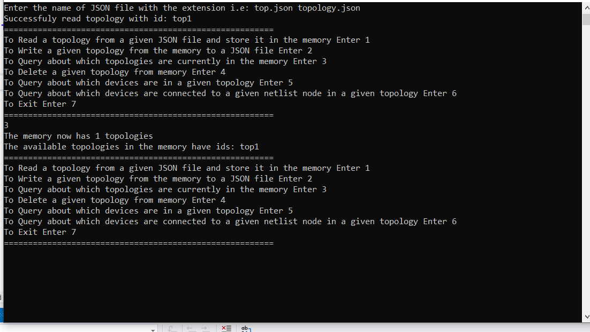

<div align="center">
<a href="https://github.com/ZeyadTarekk/Topology-API" rel="noopener">

</a>

</div>

<div align="center">

[](https://github.com/ZeyadTarekk/Topology-API/contributors)
[](https://github.com/ZeyadTarekk/Topology-API/issues)
[](https://github.com/ZeyadTarekk/Topology-API/blob/master/LICENSE)
[](https://github.com/ZeyadTarekk/Topology-API/network)
[](https://github.com/ZeyadTarekk/Topology-API/stargazers)
[](https://img.shields.io/github/languages/count/ZeyadTarekk/Topology-API)

</div>

## 📝 Table of Contents

- [About](#about)
- [Documentation](#doc)
- [Functionalities](#func)
- [Class Hierarchy](#class)
- [Get started](#get-started)
  - [Running](#running)
- [Language](#tech)
- [Screenshots](#Screenshots)
- [Contributors](#Contributors)

## 📙 About <a name = "about"></a>

- Command line program that provide the functionality to access, manage and store device topologies.

## 📃 Documentation <a name = "doc"></a>

<a href="documentation/index.html">- index.html file in documentation folder</a>

## 🏢 Functionalities <a name = "func"></a>
- Read a topology from a given JSON file and store it in the memory.
- Write a given topology from the memory to a JSON file.
- Query about which topologies are currently in the memory.
- Delete a given topology from memory.
- Query about which devices are in a given topology.
- Query about which devices are connected to a given netlist node in a given topology.

## 👨‍👩‍👧‍👧 Class Hierarchy <a name = "class"></a>
  </a>
## 🏁 Getting Started <a name = "get-started"></a>

> This is an list of needed instructions to set up your project locally, to get a local copy up and running follow these
> instructuins.

### Installation <a name = "Install"></a>

1. **_Clone the repository_**

```sh
$ git clone https://github.com/ZeyadTarekk/Topology-API.git
```

2. **_Navigate to repository directory_**

```sh
$ cd Topology-API
```

### Running <a name = "running"></a>


1. **_Running the program_**

```sh
Open Topology-API.sln
```

## 💻 Built Using <a name = "tech"></a>

- **C++**


## 📷 Demo Screenshots <a name = "Screenshots"></a>

<div align="center">
  <h3 align='left'>Main Screen</h3>
  </a>
  </a>
  </a>
  <h3 align='left'>Query about which topologies are currently in the memory</h3>
  </a>
  </a>
  <h3 align='left'>Query about which devices are in a given topology</h3>
  </a>
  <h3 align='left'>Query about which devices are connected to a given netlist node in a given topology</h3>
  </a>
  </a>
  <h3 align='left'>Delete a given topology from memory.</h3>
  </a>

</div>


## Contributors <a name = "Contributors"></a>

<table>
  <tr>
    <td align="center">
    <a href="https://github.com/ZeyadTarekk" target="_black">
    
    <br />
    <sub><b>Zeyad Tarek</b></sub></a>
    </td>
    
    
  </tr>
 </table>